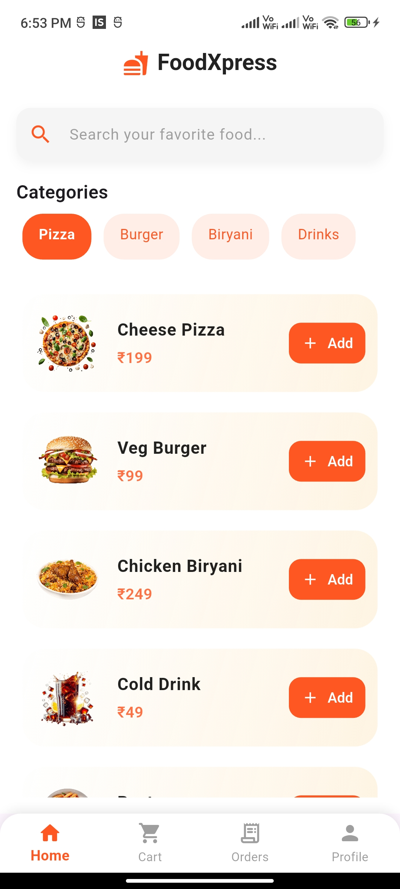
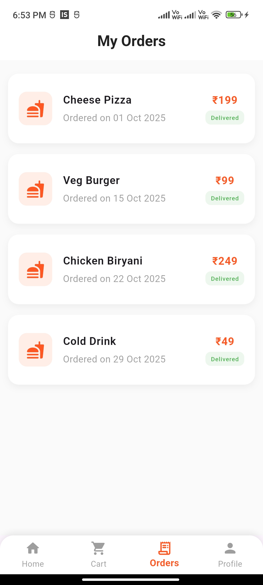
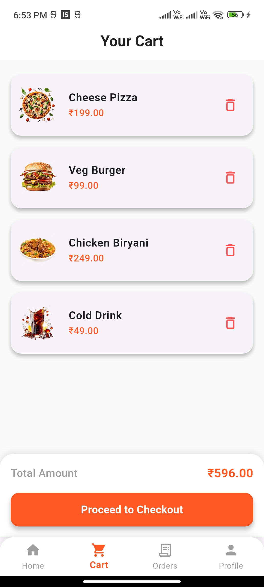

<h1 align="center">🍔 FoodXpress</h1>

<p align="center">
  <b>A modern Flutter Food Delivery App UI 🚀</b> <br>
  Clean design • Smooth animations • Cross-platform • Flutter ❤️
</p>

<p align="center">
  <a href="https://flutter.dev/"></a>
  <a href="#"></a>
  <a href="#"></a>
  <a href="#"></a>
</p>

---

## 🌟 Features

✨ Modern UI with smooth fade & slide animations  
🛒 Add to Cart functionality  
📦 Order history with formatted dates  
👤 Profile screen with logout  
🎨 Custom animated AppBar  
📱 Fully responsive layout for all screens  
⚡ Built with clean, maintainable Flutter code  

---

## 🖼️ Screenshots

| 🏠 Home | 📦 Orders | 👤 Profile | 🛒 Cart |
|:--------:|:----------:|:----------:|:----------:|
|  |  |  |   |


---

## 🧱 Folder Structure

```plaintext
lib/
├── main.dart
├── screens/
│   ├── home_screen.dart
│   ├── orders_screen.dart
│   ├── profile_screen.dart
├── widgets/
│   ├── food_card.dart
│   └── custom_appbar.dart
├── models/
│   └── food_model.dart
└── utils/
    └── constants.dart
